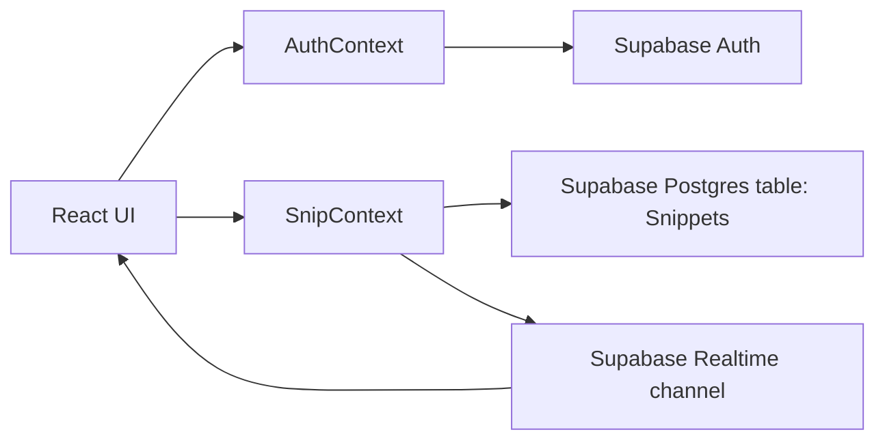

# SnipVault

SnipVault is a snippet manager built with React + TypeScript + Supabase.
It lets users sign up, store code snippets, filter snippets by language, and manage their personal snippet library with a dark/light, amber-accented dashboard UI.

## Table Of Contents

1. [What This Project Does](#what-this-project-does)
2. [Tech Stack](#tech-stack)
3. [Architecture](#architecture)
4. [Getting Started](#getting-started)
5. [Environment Variables](#environment-variables)
6. [Supabase Setup](#supabase-setup)
7. [Available Scripts](#available-scripts)
8. [Project Structure](#project-structure)
9. [Core User Flows](#core-user-flows)
10. [Data Model](#data-model)
11. [UI System](#ui-system)
12. [Social Preview (OG Image)](#social-preview-og-image)
13. [Known Issues And Limitations](#known-issues-and-limitations)
14. [Contributing](#contributing)

## What This Project Does

SnipVault supports:

- Email/password authentication via Supabase Auth
- Email confirmation flow for new users
- Creating snippets with `title`, `language`, `code`, and optional `note`
- Language-based filtering on the dashboard
- Expanding/collapsing snippet cards for code preview
- Copy-to-clipboard and delete actions
- Real-time UI updates for newly inserted snippets (Supabase Realtime)
- Responsive sidebar navigation and theme toggle

## Tech Stack

- `React 19` + `TypeScript`
- `Vite 8`
- `React Router 7`
- `Tailwind CSS 4`
- `Supabase JS 2` (Auth, Postgres, Realtime)
- `Radix UI Select` + shadcn-style component source (`src/components/ui/select.tsx`)
- `Lucide React` icons

## Architecture



- `AuthContext` owns session state and auth actions (`logIn`, `signUp`, `logOut`).
- `SnipContext` owns snippet list state and CRUD-like actions (`addSnip`, `deleteSnip`, fetch on mount).
- `Supabase.ts` creates a single Supabase client used across contexts.

## Getting Started

### Prerequisites

- Node.js `18+` (recommended `20+`)
- npm
- A Supabase project

### Install

```bash
npm install
```

### Run Development Server

```bash
npm run dev
```

Default dev URL:

```text
http://localhost:5173
```

### Production Build

```bash
npm run build
```

### Preview Production Build

```bash
npm run preview
```

## Environment Variables

Create a `.env` file in the project root:

```bash
VITE_SUPABASE_URL=your_supabase_project_url
VITE_SUPABASE_ANON_KEY=your_supabase_anon_key
```

Important:

- Variables must be prefixed with `VITE_` for Vite to expose them to client code.
- Do not commit real credentials.

## Supabase Setup

Create a table named `Snippets` with fields compatible with the app:

- `id` (number, primary key, identity)
- `title` (text)
- `language` (text)
- `code` (text)
- `note` (text, nullable)
- `email` (text)
- `created_at` (timestamp, default now)

Recommended:

- Enable Row Level Security (RLS)
- Add policies so authenticated users can only read/write their own rows (by `email` or `auth.uid()` if schema is updated)

Realtime:

- Realtime subscription listens for `INSERT` events on `public.Snippets`
- New rows are appended to local UI state automatically

## Available Scripts

- `npm run dev`: start Vite dev server
- `npm run build`: type-check and build for production
- `npm run preview`: preview built app
- `npm run lint`: run ESLint

## Project Structure

```text
src/
  App.tsx                    # Authenticated vs unauthenticated routing shell
  main.tsx                   # Providers + app bootstrap
  index.css                  # Tailwind import and base styles
  supabase/Supabase.ts       # Supabase client
  context/
    AuthContext.tsx          # Session and auth actions
    SnipContext.tsx          # Snippet state and data actions
  pages/
    Auth.tsx                 # Login/sign-up page
    Dashboard.tsx            # Main snippet dashboard
    CreateSnip.tsx           # Route wrapper for snippet editor
  component/
    Navbar.tsx               # Sidebar + mobile nav
    SnipEditor.tsx           # Create snippet form
    SnipTemplate.tsx         # Snippet card UI
    Confirm.tsx              # Email confirmation page
  components/ui/
    select.tsx               # Reusable themed select component
  constants/
    languages.ts             # Supported snippet language options
  lib/
    utils.ts                 # className utility (cn)
public/
  logo.png
  favicon.png
  og-image.png
```

## Core User Flows

### Authentication

1. User opens `/`
2. If no session: render `Auth` page
3. Sign up sends confirmation email via Supabase
4. Confirm route (`/confirm`) guides user back to login
5. On successful login, app switches to dashboard routes

### Snippet Lifecycle

1. User goes to `/create`
2. Fills form and submits
3. `addSnip` inserts row into Supabase
4. Realtime `INSERT` event updates dashboard list
5. User can filter, expand, copy, and delete snippets

## Data Model

In UI state, each snippet is represented as:

```ts
type Snippet = {
  id: number;
  title: string;
  language: string;
  code: string;
  note: string;
  email: string;
};
```

## UI System

- Theme mode is stored in `localStorage` under `theme`.
- Light mode uses white surfaces; dark mode uses black surfaces.
- Amber/yellow is used for accents, borders, and visual emphasis.
- Snippet language input uses a reusable Radix/shadcn-style Select component.

## Social Preview (OG Image)

The project includes Open Graph/Twitter metadata in `index.html` and uses:

- `public/og-image.png` (`1200x630`)

This powers branded previews when links are shared on social platforms.

## Known Issues And Limitations

- `npm run lint` currently reports existing issues in context files:
  - `AuthContext.tsx`
  - `SnipContext.tsx`
- Realtime subscription currently listens only for `INSERT` events.
  - Deletes are handled locally after delete action.
  - External deletes/updates are not currently subscribed.
- Current snippet query fetches all rows from `Snippets`.
  - Add user-scoped filtering and RLS policies for stricter multitenancy.

## Contributing

1. Fork and clone the repository
2. Create a feature branch
3. Add or update tests/lint fixes when applicable
4. Open a pull request with a clear summary and screenshots for UI changes

For larger changes, keep docs in sync with code (`README`, env vars, and schema changes).
